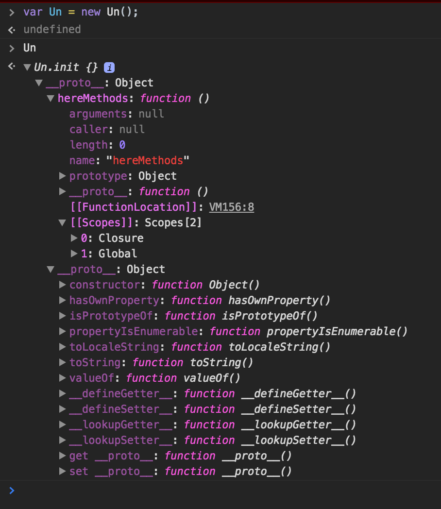

## Question: Un 의 방식과, Deux 의 방식의 차이점이 알고 싶습니다.

- 첫번째 방법은 Udemy 를 통해 알게된 방법입니다. 구조는 콘솔을 활용해 그림을 그려보았습니다.

```javascript
(function(global) {

    var Un = function() {
        return new Un.init();
    }

    Un.prototype = {
      hereMethods: function(){}
      // method 들이 들어가는 Un 의 prototype
    };

    Un.init = function() {

    }

    Un.init.prototype = Un.prototype;

    global.Un = global.G$ = Un;

}(window));
```


- 두번째 방법은 위의 방법에서 Un 의 생성자 함수를 통해 반환된 새로운 `Un.init` 이라는 객체이며, 해당 `Un.init` 의 프로토타입을 `Un.prototype` 과 링크함으로써, `Un.prototype` 내부의 메소드에 접근하게 해주는 방식이 이런 생각(왜.. 저렇게 해야하는걸까 특별한 이유가 있는건가..) 이 들어서 간략하게 줄여본 방법입니다.

```javascript
(function(global) {

    var Deux = function() {}

    Deux.prototype = {
      hereMethods: function(){}
      // method 들이 들어가는 Deux 의 prototype
    };

    global.Deux = global.G$ = Deux;

}(window));
```


- 콘솔에서 확인해보았을 때는 제 눈으로는 큰 객체상의 구조에 차이는 잘 보이지 않습니다.
- 다만, Un 에서는 [[FunctionLocation]] 과 [[Scopes]] 라는.. 미지의 속성(?) 들이 보이고, Deux 에서는 보이지 않는걸 확인했습니다.
- 정말 수많은 방법과 디자인 패턴이 있고, 지금의 이해 수준에서는 어느 것을 가져다가 써도 코드가 작동하고 사용하는데에 무리는 없었습니다만, 무언가 이유를 모르고 사용하고 싶지는 않은 욕심이 생깁니다. 도와주세요 야무 강사님 : )



